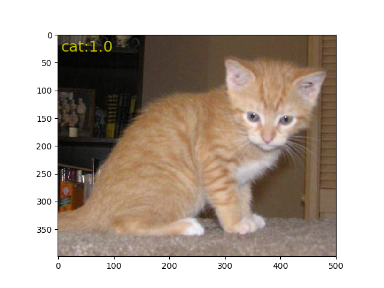
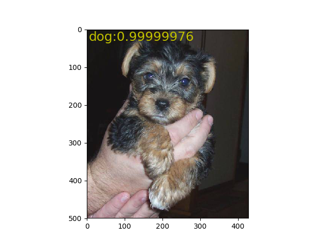

# VGG16 in TensorFlow

This repo contains the implementation of **VGG16** in TensoFlown for cat-and-dog classification.

For more information about VGG16 you can check out [Very Deep Convolutional Networks for Large-Scale Image Recognition](https://arxiv.org/pdf/1409.1556v6.pdf)

# Requirements

To use this repo you need to have:

* [CUDA](https://developer.nvidia.com/cuda-toolkit) (tested with 9.0)
* [https://www.tensorflow.org/](TensorFlow) (tested with 1.11.0)

# Dataset
The dataset of this repo can be downloaded from [kaggle](https://www.kaggle.com/tongpython/cat-and-dog)

# Pre-trained Weights
The pre-trained weights in **Alexnet_weights** folder can be obtained from my Baidu Netdisk
* **link** https://pan.baidu.com/s/1zo903zsjidkJBE6ugGXEnQ  **password:** fdm4

# Result
The accuracy on test dataset is 0.987399.

